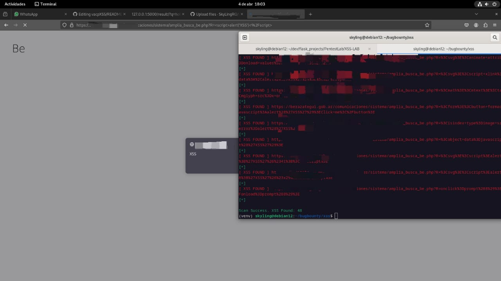

# 🛠️ vacpXSS

vacpXSS toma como entrada una lista de URLs (o endpoints) y las analiza inyectando múltiples payloads de XSS. Luego verifica si alguno de estos payloads se refleja directamente en la respuesta HTML sin ser filtrado o escapado, lo cual es un fuerte indicio de una vulnerabilidad XSS reflejada.
La herramienta puede ser utilizada tanto para entornos de testing como para escaneos rápidos sobre múltiples dominios objetivos.

---

## 📦 Instalación

```bash
git clone https://github.com/SkyLingRQ/vacpXSS
cd vacpXSS
python3 -m pip install -r requirements.txt
```

---

## 🚀 Uso

```bash
python3 vacpxss.py -f archivo_con_los_endpoints.txt -o nombre_del_archivo_a_guardar.txt
```
